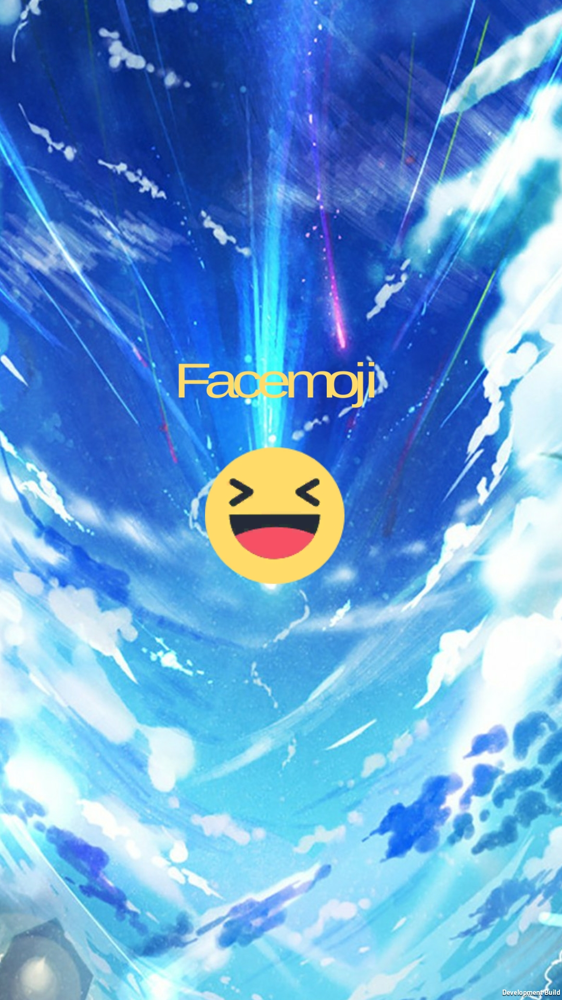
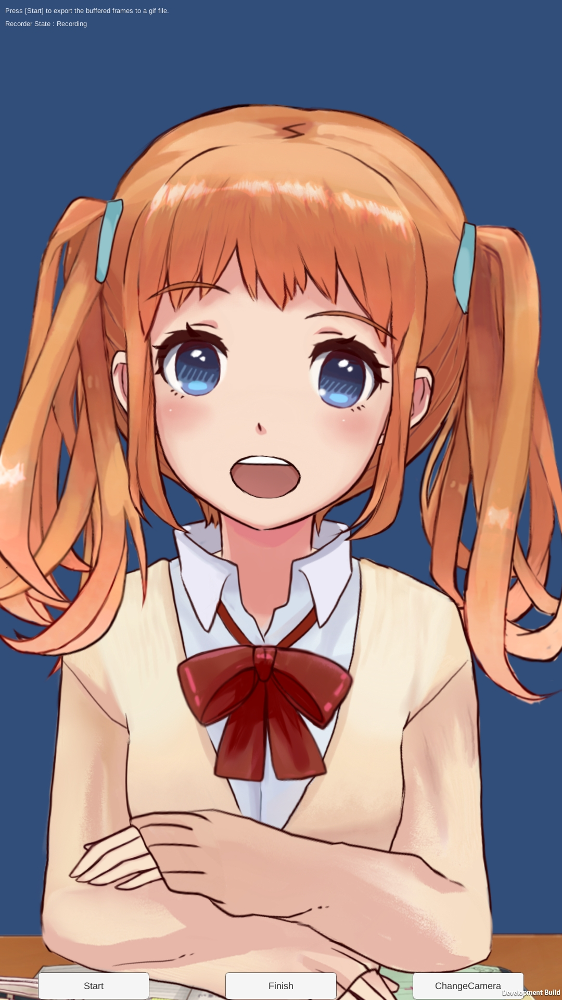
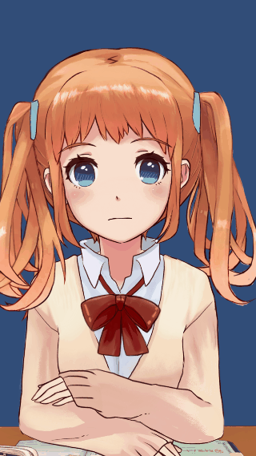

# Facemoji

A Unity project that detects facial expressions, converts them into emoji or cartoon images, and generates gif images or small videos.

## Assets Library

### Official

* [OpenCVForUnity](https://enoxsoftware.com/opencvforunity/)
* [DlibFaceLandmarkDetector](https://enoxsoftware.com/dlibfacelandmarkdetector/)
* [shape_predictor_68_face_landmarks.dat.bz2](http://dlib.net/files/shape_predictor_68_face_landmarks.dat.bz2)
* [Live2D Cubism SDK](http://sites.cybernoids.jp/cubism-sdk2_e/unity_2-1)
* [DlibFaceLandmarkDetectorWithLive2DSample](https://github.com/utibenkei/DlibFaceLandmarkDetectorWithLive2DSample)
* [Recorder](https://github.com/Chman/Moments)

### Unofficial

* [drive.google . Facemoji](https://drive.google.com/open?id=1ofJMFIdzXCdYYO3qO5hvrTQPJUumgSY-)
* [pan.baidu . Facemoji](http://pan.baidu.com/s/1eSnKtoQ)

## Usage

* Download `shape_predictor_68_face_landmarks.dat` and `OpenCV_and_Dlib_for_Unity.unitypackage` from [drive.google . Facemoji](https://drive.google.com/open?id=1ofJMFIdzXCdYYO3qO5hvrTQPJUumgSY-) or [pan.baidu . Facemoji](http://pan.baidu.com/s/1eSnKtoQ)
* `git clone https://github.com/huihut/Facemoji.git`
* Create new Unity project (called `Facemoji`)
* Copy `Facemoji/*` to your unity project
* Copy `shape_predictor_68_face_landmarks.dat` to `Facemoji/Assets/StreamingAssets/`
* Import `OpenCV_and_Dlib_for_Unity.unitypackage`
* Build & Run

## Releases

* [Github . Facemoji/releases](https://github.com/huihut/Facemoji/releases)
* [pan.baidu . Facemoji/Platform](http://pan.baidu.com/s/1eSnKtoQ)

## Preview

Start app, click `emoji` !

Click the `Start` button to record 3 seconds of gif !

Recorder State : **Recording**(Ready to record) -> **PreProcessing**(Is recording) -> **Paused**(Processing gif) -> **Recording**(Ready to record)

Save the gif in `Application.dataPath`

(Android in `/storage/emulated/0/Android/data/com.huihut.facemoji/files/`)

