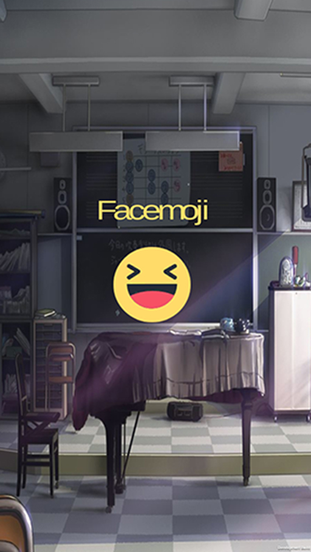
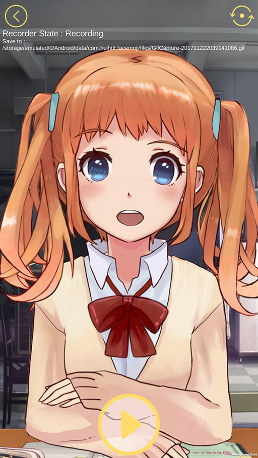

# Facemoji

A Unity project that detects facial expressions, converts them into emoji or cartoon images, and generates gif images or small videos.

## Assets Library

### Official

* [OpenCVForUnity](https://enoxsoftware.com/opencvforunity/)
* [DlibFaceLandmarkDetector](https://enoxsoftware.com/dlibfacelandmarkdetector/)
* [shape_predictor_68_face_landmarks.dat.bz2](http://dlib.net/files/shape_predictor_68_face_landmarks.dat.bz2)
* [Live2D Cubism SDK](http://sites.cybernoids.jp/cubism-sdk2_e/unity_2-1)
* [DlibFaceLandmarkDetectorWithLive2DSample](https://github.com/utibenkei/DlibFaceLandmarkDetectorWithLive2DSample)
* [Recorder](https://github.com/Chman/Moments)

### Unofficial

* [Drive.Google](https://drive.google.com/open?id=1ofJMFIdzXCdYYO3qO5hvrTQPJUumgSY-)
* [Pan.Baidu](http://pan.baidu.com/s/1eSnKtoQ)

## Setup

* Download `shape_predictor_68_face_landmarks.dat`(Facial Landmark Detector) and `Facemoji_Plugins_Assets.unitypackage`(Streamlined OpenCV, Dlib, Live2D Assets Library) from [Drive.Google](https://drive.google.com/open?id=1ofJMFIdzXCdYYO3qO5hvrTQPJUumgSY-) or [Pan.Baidu](http://pan.baidu.com/s/1eSnKtoQ)
* `git clone https://github.com/huihut/Facemoji.git`
* Create new Unity project (called `FacemojiDemo`)
* Copy `Facemoji/Assets` and `Facemoji/ProjectSettings` to your unity project (`FacemojiDemo/`)
* Copy `shape_predictor_68_face_landmarks.dat` to your `FacemojiDemo/Assets/StreamingAssets/`
* Import `Facemoji_Plugins_Assets.unitypackage`
* Build & Run

## Releases

* [Github . Facemoji/releases](https://github.com/huihut/Facemoji/releases)
* [Drive.Google . Facemoji/Platform](https://drive.google.com/open?id=1ofJMFIdzXCdYYO3qO5hvrTQPJUumgSY-)
* [Pan.Baidu . Facemoji/Platform](http://pan.baidu.com/s/1eSnKtoQ)

## Preview

Start app, click the `emoji` !

Click the `Start Button` below to record 3 seconds of gif !

Recorder State : **Recording**(Ready to record) -> **PreProcessing**(Is recording) -> **Paused**(Compressing gif) -> **Recording**(Ready to record)

Save the gif in `Application.dataPath`

(Android in `/storage/emulated/0/Android/data/com.huihut.facemoji/files/`)

## Gif

* Come On ! （加油！）
    
    

* No~ No~（不要~ 不要~）
    
    

* Wink ! （放电！）
    
    