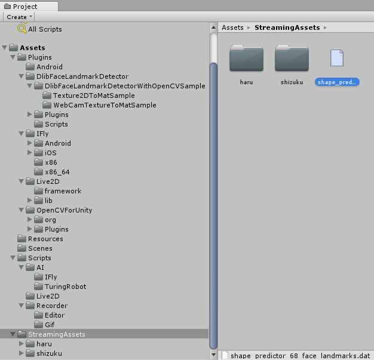
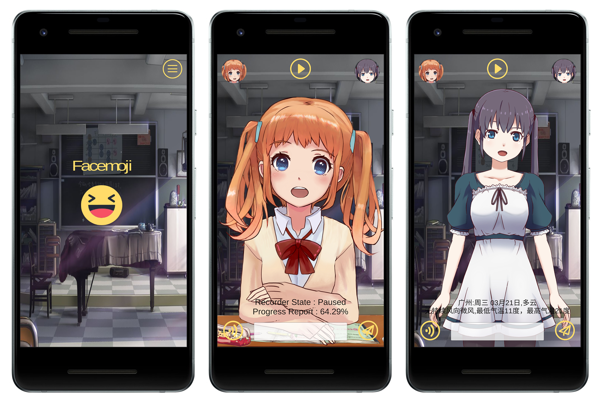

# 废萌（Facemoji）

一个Unity项目（暂时只适配Android），有两个模块：

* 模块一是**实时人脸卡通化（FaceTracking）**，使用**OpenCV**和**Dlib**检测面部表情，并实时转化为**Live2D**模型，然后可录制成gif图；
* 模块二是**AI人工智能** ~~（聊天机器人）~~ 使用**图灵机器人**、**讯飞IAT语音听写**、**讯飞TTS语音合成**进行语音聊天。

[English README.md](README.md)

## 资源库

### 官方

* [OpenCVForUnity](https://enoxsoftware.com/opencvforunity/)
* [DlibFaceLandmarkDetector](https://enoxsoftware.com/dlibfacelandmarkdetector/)
* [shape_predictor_68_face_landmarks.dat.bz2](http://dlib.net/files/shape_predictor_68_face_landmarks.dat.bz2)
* [Live2D Cubism SDK](http://sites.cybernoids.jp/cubism-sdk2_e/unity_2-1)
* [DlibFaceLandmarkDetectorWithLive2DSample](https://github.com/utibenkei/DlibFaceLandmarkDetectorWithLive2DSample)
* [Recorder](https://github.com/Chman/Moments)
* [TuringRobot](https://github.com/huihut/TuringRobot)

### 网盘

* [Drive.Google](https://drive.google.com/open?id=1ofJMFIdzXCdYYO3qO5hvrTQPJUumgSY-)
* [Pan.Baidu](http://pan.baidu.com/s/1eSnKtoQ)

## Releases

* [Github . Facemoji/releases](https://github.com/huihut/Facemoji/releases)
* [Drive.Google . Facemoji/Platform](https://drive.google.com/open?id=1ofJMFIdzXCdYYO3qO5hvrTQPJUumgSY-)
* [Pan.Baidu . Facemoji/Platform](http://pan.baidu.com/s/1eSnKtoQ)

## 制作

1. 从 [Drive.Google](https://drive.google.com/open?id=1ofJMFIdzXCdYYO3qO5hvrTQPJUumgSY-) 或者 [Pan.Baidu](http://pan.baidu.com/s/1eSnKtoQ)下载 `shape_predictor_68_face_landmarks.dat`（人脸特征点检测器） 和 `Facemoji_Plugins_Assets_1.5.0.unitypackage` （精简的 OpenCV, Dlib, Live2D 和 Iflytek 库） 
2. `git clone https://github.com/huihut/Facemoji.git`
2. 创建一个新的Unity项目，命名为`FacemojiDemo`
3. 复制 `Facemoji/Assets` 和 `Facemoji/ProjectSettings` 到你的项目 (`FacemojiDemo/`)
4. 把`shape_predictor_68_face_landmarks.dat`复制到`FacemojiDemo/Assets/StreamingAssets/`
5. 导入`Facemoji_Plugins_Assets_1.5.0.unitypackage`。导入后的文件结构如下：
    
6. 转换平台到Android（其他平台未适配）
7. Build & Run

## 使用

### 实时人脸卡通化（FaceTracking）

使用**OpenCV**和**Dlib**检测面部表情，并实时转化为**Live2D**模型；

她可以跟着你的头部表情动，试着摇头看看吧。

### 录制 gif 图

点击顶部中间的录制键可以录制3秒的gif；

录制状态为：Recording（准备录制）、PreProcessing（正在录制）、Paused（正在压缩成gif图）

生成的gif存储在`Application.dataPath`，Android平台的话在`/storage/emulated/0/Android/data/com.huihut.facemoji/files/`

### 语音和文字聊天（~~聊天机器人？~~ 她说她是AI，不是机器人！ hhhh...）

使用**图灵机器人**、**讯飞IAT语音听写**、**讯飞TTS语音合成**

她很智能（~~zhizhang~~），可以：

* 聊天对话
* 生活百科
* 数学计算
* 故事大全
* 笑话大全
* 成语接龙
* 星座运势
* 天气查询
* ...

但是由于她是个中国AI（~~机器人~~），图灵机器人只支持中文，所以她只能进行中文聊天，和她讲英文她只会翻译。

不过她以后会学习英文的（~~换个会讲英文的~~）。

## 预览

## Gif

* Come On ! （加油！）
    
    

* No~ No~（不要~ 不要~）
    
    

* Wink ! （放电！）
    
    